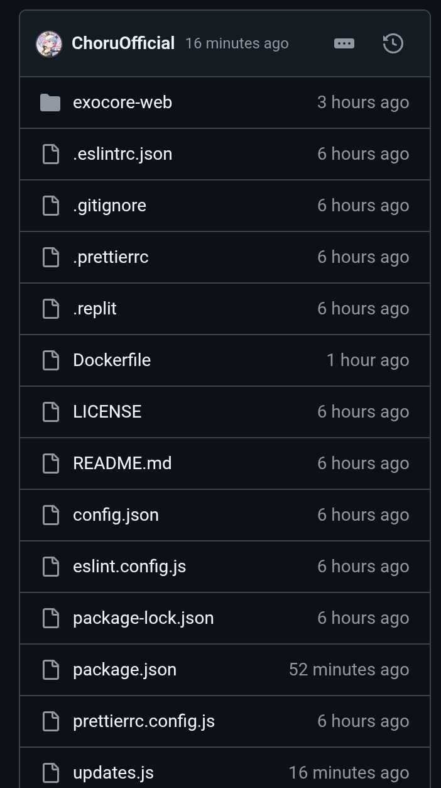

Sure! Here's a cleaned-up, fully English, and more descriptive version of your Markdown guide, with better structure and clarity while keeping your original message intact:


---

# 🌐 Exocore-Web GitHub Guide

Welcome! This guide will walk you through the initial steps to set up and customize the **Exocore Web** project.

---

## 🚀 Step 1: Fork the Repository

Begin by forking the official repository to your GitHub account:

# 🔗 [Exocore-Organization/exocore-web](https://github.com/Exocore-Organization/exocore-web)

---

## 🖼️ Project Preview

Here’s a preview screenshot of the project’s home screen:



---

## 🔧 Step 2: Locate the `config.json` File

Once you've cloned the project, look for the `config.json` file inside the project directory. This file contains important configuration settings such as the default username and password.

Here’s the default content:

```json
{
  "user": "RootAdminChoru",
  "pass": "Stevepen4321!"
}

```
---

✨ Step 3: Update Your Credentials

For security purposes, it's strongly recommended that you change the default username and password to your own values:
```json
{
  "user": "YourCustomUsername",
  "pass": "YourStrongPassword123"
}
```
> ⚠️ Make sure to use a secure and unique password to prevent unauthorized access.


---

✅ You're Ready!

Once you've updated the credentials, you're ready to run and explore the project. If you encounter issues or want to contribute, feel free to open an issue or pull request on the original repository.

Happy coding! 💻✨

---